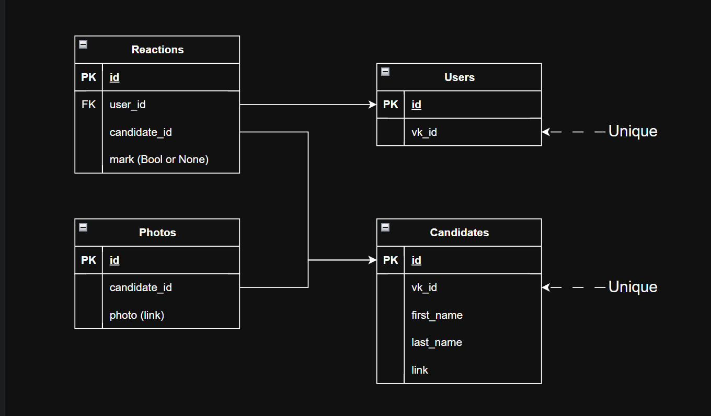

Оглавление:
- [Backend. Пет-проекты и учебные проекты](#backend-пет-проекты-и-учебные-проекты)
  - [Пет-проект](#пет-проект)
    - [ROCK FROG RPG — Telegram-бот (RPG)](#rock-frog-rpg--telegram-бот-rpg)
  - [Учебные проекты](#учебные-проекты)
      - [Резервное копирование фотографий VK → Яндекс.Диск](#резервное-копирование-фотографий-vk--яндексдиск)
    - [VKinder — бот для знакомств ВКонтакте (командный проект)](#vkinder--бот-для-знакомств-вконтакте-командный-проект)
  - [Дополнительно:](#дополнительно)
    - [Базы данных (SQL, Postgres, SQLAlchemy): примеры решённых задач](#базы-данных-sql-postgres-sqlalchemy-примеры-решённых-задач)

# Backend. Пет-проекты и учебные проекты

## Пет-проект

### ROCK FROG RPG — Telegram-бот (RPG)

[GitHub — Lampropeltiss/rock_frog_rpg](https://github.com/Lampropeltiss/rock_frog_rpg)

**Обзор проекта:**  
Асинхронный Telegram-бот в жанре RPG. Реализована полноценная игровая логика: экспедиции, город, система инвентаря и характеристик персонажа. Бот использует машину состояний (FSM) для управления диалогами и действиями игрока. Данные игры хранятся в JSON-файлах, а состояние пользователей — в PostgreSQL. Логирование вынесено в отдельный модуль с цветным выводом в консоль.

**Стек технологий:**
- **Aiogram** — основной фреймворк для Telegram-бота (маршрутизация, клавиатуры, FSM)
- **Aiohttp** — асинхронный HTTP-клиент
- **SQLAlchemy** + **asyncpg** — асинхронная работа с PostgreSQL
- **Alembic** — миграции базы данных
- **Pydantic** — валидация данных
- **Python-dotenv** — управление переменными окружения
- **Colorama** — цветное логирование

---

## Учебные проекты

#### Резервное копирование фотографий VK → Яндекс.Диск

[GitHub — Lampropeltiss/hw_api](https://github.com/Lampropeltiss/hw_api)

**Обзор проекта:**  
Утилита для резервного копирования фотографий из VK в облачное хранилище Яндекс.Диск. Пользователь указывает ID профиля VK, выбирает альбом (профиль или стена) и количество фотографий. Программа загружает выбранные изображения на Яндекс.Диск и при необходимости сохраняет локальные копии. В процессе работы отображаются прогресс-бары и цветные логи в консоли.

**Стек технологий:**
- **Requests** — HTTP-запросы к VK API и API Яндекс.Диска
- **Colorama** — цветной вывод логов
- **Tqdm** — прогресс-бары для визуализации этапов работы
- **Python-dotenv** — управление токенами и настройками

---

### VKinder — бот для знакомств ВКонтакте (командный проект)

[GitHub — Lampropeltiss/VKinder](https://github.com/Lampropeltiss/VKinder)

**Обзор проекта:**  
Командная разработка VK-бота для поиска кандидатов для знакомств. Бот анализирует профиль пользователя, подбирает подходящих кандидатов, показывает их анкеты и позволяет добавлять понравившихся в избранное. Взаимодействие происходит через личные сообщения ВКонтакте.

**Мой вклад в проект:**
- **База данных:** разработала схему БД, спроектировала модели данных и настроила связи между ними (пользователи, кандидаты, реакции, фото).
- **Класс VkBotDatabase:** реализовала полноценный класс-обёртку с набором методов для всех операций с БД — добавление, поиск, удаление, проверка наличия записей.
- **Логирование:** настроила систему логирования для отслеживания работы базы данных.

**Стек технологий:**
- **VK API** — работа с сообщениями, событиями и данными пользователей
- **Requests** — выполнение HTTP-запросов
- **SQLAlchemy** + **psycopg2-binary** — работа с базой данных PostgreSQL
- **Python-dotenv** — хранение токенов и настроек

---

## Дополнительно:

### Базы данных (SQL, Postgres, SQLAlchemy): примеры решённых задач

- БД: [Схемы БД с приложенными sql-запросами для их создания, выполненные в соответствии с наборами требований](https://github.com/Lampropeltiss/schemes)
- Выборка данных: [SELECT-запросы](https://github.com/Lampropeltiss/selects)
- Работа с PostgreSQL из Python: [программа для управления клиентами на Python](https://github.com/Lampropeltiss/hw_db_5)
- Python и БД. ORM: [программа для работы с системой контроля продажи книг](https://github.com/Lampropeltiss/hw_db_6)